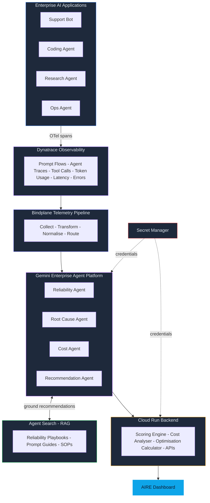

<div align="center">

#  AIRE — AI Reliability Engineer

### *Diagnose failures. Optimise costs. Score reliability. Improve AI agents.*

[](https://cloud.google.com/vertex-ai)
[](https://www.dynatrace.com/)
[](https://cloud.google.com/gemini)
[](LICENSE)

<br>

> **AIRE uses Dynatrace observability data and Gemini reasoning to automatically diagnose failures, optimise costs, score reliability, and improve the performance of enterprise AI agents — with every recommendation grounded in your internal playbooks and quantified before it ships.**

<br>

| 69 → 93 | 67% | −38% | $1,640/day |
|:---:|:---:|:---:|:---:|
| Reliability Score | Failures traced to | Token reduction | Simulated daily |
| before → after fix | root cause | from optimisation | cost savings |

</div>

---

## 📐 System Architecture



---

## 🔄 How AIRE Works — Step by Step

```
 ┌──────────────┐     ┌──────────────┐     ┌──────────────┐     ┌──────────────┐
 │  AI App runs │────▶│ OTel wraps   │────▶│ Dynatrace    │────▶│ Bindplane    │
 │  in prod     │     │ every call   │     │ captures all │     │ normalises   │
 └──────────────┘     └──────────────┘     └──────────────┘     └──────┬───────┘
                                                                       │
 ┌──────────────┐     ┌──────────────┐     ┌──────────────┐     ┌──────▼───────┐
 │  Dashboard   │◀────│ Cloud Run    │◀────│ Agent Search │◀───▶│ 4 Gemini     │
 │  real-time   │     │ simulates    │     │ grounds recs │     │ Agents       │
 └──────────────┘     └──────────────┘     └──────────────┘     └──────────────┘
```

| Step | What Happens |
|:----:|:-------------|
| **1** | An enterprise AI app handles a user request — calling APIs, tools, and models in sequence |
| **2** | OTel instrumentation wraps every prompt, model call, tool call, and response — capturing token usage, latency, errors, and retries with **zero changes** to the app's core logic |
| **3** | Dynatrace collects the full picture: prompt flows, agent traces, tool call sequences, token burn rates, latency distributions, and failure patterns |
| **4** | Bindplane normalises raw events into a consistent schema and routes enriched data downstream — no Dynatrace SDK dependency in agent code |
| **5** | Four specialist Gemini agents reason over the telemetry **in parallel**: Reliability scores health, Root Cause traces failures, Cost spots waste, Recommendation synthesises fixes |
| **6** | Agent Search grounds every recommendation in real documentation — preventing hallucinated suggestions and ensuring advice is traceable to a source |
| **7** | Cloud Run services calculate reliability scores, model cost impact, and run optimisation simulations **before** any fix ships |
| **8** | The AIRE Dashboard surfaces everything in real time: score, root cause, cost insights, agent comparison, and ranked optimisation suggestions |

---

## The Four Gemini Agents

### Reliability Analysis Agent

- Ingests traces, latency histograms, and error rate time-series
- Calculates a **composite Reliability Score (0–100)** weighted by success rate, P95 latency, error rate, and tool stability
- Flags agents scoring below threshold with an explanation
- Compares score trends across sessions
- Tags findings with Dynatrace trace IDs for auditability

```json
{
  "score": 82,
  "breakdown": { "success": 95, "latency": 78, "errors": 71, "tools": 84 },
  "trend": "declining",
  "citations": ["trace-abc123", "trace-def456"]
}
```

---

### Root Cause Agent

- Correlates failure spikes with specific tool calls, prompt patterns, or retrieval events
- Identifies failure clusters: tool timeout, model error, context overflow, retry exhaustion
- Produces a **ranked list of root causes** with failure-percentage attribution
- Cross-references Agent Search for known failure modes
- Surfaces the exact Dynatrace span where the chain began

```json
{
  "top_cause": "shipping_api timeout",
  "pct": 67,
  "span_id": "span-789xyz",
  "playbook_ref": "reliability-guide-v3-§4.2"
}
```

---

###  Cost Optimisation Agent

- Analyses token usage per request: prompt, completion, retrieval chunk size
- Identifies **speculative tool calls** — invoked every request but rarely needed
- Flags oversized context: retrieval returning more chunks than used
- Calculates daily and monthly cost impact per inefficiency
- Simulates token and latency reduction from each proposed fix

```json
{
  "waste_tokens_pct": 38,
  "est_daily_saving": "$1,640",
  "top_fix": "reduce retrieval k from 12 to 3"
}
```

---

###  Recommendation Agent

- Receives structured outputs from all three upstream agents
- De-duplicates overlapping suggestions and ranks by expected reliability impact
- Queries Agent Search for **implementation guidance** before finalising
- Formats top-3 fixes as human-readable actions with before/after metrics
- Passes output through **Gemini Safety filter** — blocks harmful suggestions

```json
{
  "recommendations": [
    { "fix": "Add lazy tool-calling", "impact": "+24 reliability", "effort": "low" },
    { "fix": "Reduce retrieval k=3", "impact": "-38% tokens", "effort": "low" },
    { "fix": "Add 1s timeout + retry", "impact": "-63% failures", "effort": "medium" }
  ]
}
```

---

##  OTel Instrumentation Pattern

The key instrumentation that powers AIRE's analysis:

```python
from opentelemetry import trace

tracer = trace.get_tracer("aire-monitored-agent")

# Parent span — wraps one full user request through the AI agent
with tracer.start_as_current_span("agent.request") as parent:
    parent.set_attribute("agent.type", "customer_support")
    parent.set_attribute("session.id", session_id)
    parent.set_attribute("model.prompt_tokens", usage.prompt_tokens)

    # Child span for each tool call — this is where AIRE detects timeouts and waste
    with tracer.start_as_current_span("tool.shipping_api") as tool_span:
        tool_span.set_attribute("tool.name", "shipping_api")
        tool_span.set_attribute("tool.latency_ms", elapsed_ms)
        tool_span.set_attribute("tool.status", status)           # "success" | "timeout" | "error"
        tool_span.set_attribute("tool.was_speculative", True)    # key signal for Cost Agent
        tool_span.set_attribute("tool.retry_count", retries)

    # Bindplane collects all spans — no Dynatrace SDK needed in this file
```

> **Key attributes**: `tool.was_speculative` identifies unnecessary tool calls. `tool.status = "timeout"` lets the Root Cause Agent find failure patterns from structured data, not log parsing.

---

##  Project Structure

```
AIRE/
├── Apps/                           # Demo AI Applications
│   ├── customer_support_agent.py   #    Support bot with planted failures
│   ├── coding_agent.py             #    Code review assistant
│   ├── research_agent.py           #    RAG-powered research agent
│   ├── enterprise_agent.py         #    Internal ops automation
│   └── otel_setup.py               #    Shared OTel instrumentation config
│
├── observability/                  # Dynatrace Integration Layer
│   ├── dynatrace_client.py         #    API client for Dynatrace
│   ├── otel_exporter.py            #    OTLP exporter configuration
│   ├── trace_collector.py          #    Trace collection & processing
│   ├── metric_collector.py         #    Metric aggregation
│   └── dynatrace_config.yaml       #    Dynatrace environment config
│
├── agents/                         # Gemini Enterprise Agent Platform
│   ├── reliability_agent.py        #    Reliability scoring agent
│   ├── root_cause_agent.py         #    Root cause analysis agent
│   ├── cost_agent.py               #    Cost optimisation agent
│   ├── recommendation_agent.py     #    Recommendation synthesis agent
│   ├── agent_orchestrator.py       #    Parallel agent dispatch
│   └── gemini_client.py            #    Gemini API client wrapper
│
├── knowledge/                      # Agent Search + RAG Pipeline
│   ├── agent_search.py             #    Discovery Engine search client
│   ├── datastore_client.py         #    Data store management
│   ├── rag_pipeline.py             #    Full RAG pipeline orchestration
│   ├── document_loader.py          #    Document ingestion
│   ├── embeddings.py               #    Text embedding generation
│   └── docs/                       #    Knowledge base documents
│       ├── reliability_playbooks.md
│       ├── prompt_engineering_guide.md
│       └── ai_best_practices.md
│
├── services/                       # Cloud Run Backend Services
│   ├── main.py                     #    FastAPI application entry point
│   ├── reliability_scorer.py       #    Weighted reliability scoring engine
│   ├── cost_analyzer.py            #    Cost analysis & projections
│   ├── optimization_calc.py        #    Before/after simulation engine
│   ├── recommendation_api.py       #    Recommendation formatting API
│   └── Dockerfile                  #    Container image definition
│
├── security/                       # Secret Manager Integration
│   ├── secret_manager.py           #    GCP Secret Manager client
│   ├── credentials.py              #    Credential resolution logic
│   └── .env.example                #    Environment variable template
│
├── safety/                         # Gemini Safety Controls
│   ├── safety_config.py            #    Safety filter configuration
│   ├── safety_rules.yaml           #    Rule definitions
│   └── action_validator.py         #    Action validation before execution
│
├── deploy/                         # Deployment Configuration
│   ├── deploy.sh                   #    One-command deployment script
│   ├── cloudbuild.yaml             #    CI/CD pipeline
│   ├── cloud_run_service.yaml      #    Cloud Run service definition
│   ├── k8s_deployment.yaml         #    Kubernetes deployment (optional)
│   └── agent_runtime.py            #    Agent execution runtime
│
├── dashboard/                      # React Frontend (Vite)
│   └── src/
│       ├── components/
│       │   ├── Dashboard.jsx       #    Main dashboard layout
│       │   ├── ReliabilityScore.jsx #    Score gauge with trend
│       │   ├── RootCausePanel.jsx   #    Root cause breakdown
│       │   ├── CostInsights.jsx     #    Cost analysis cards
│       │   ├── AgentComparison.jsx  #    Multi-agent comparison view
│       │   ├── Recommendations.jsx  #    Ranked fix suggestions
│       │   └── App.jsx              #    App root component
│       ├── style.css               #    Global styles
│       └── main.jsx                #    Entry point
│
├── telemetry_pipeline/             # Bindplane Pipeline Config
├── tests/                          # Unit & Integration Tests
├── scripts/                        # Development Utilities
├── docker-compose.yml              #    Full local stack
├── requirements.txt                #    Python dependencies
└── pyproject.toml                  #    Project metadata
```

---

## 🛠️ All Resources Used

### Google Cloud Platform

| | Resource | Purpose |
|:---:|:---------|:--------|
| I | **Gemini Enterprise Agent Platform** | Hosts all four specialist agents. Each agent receives normalised telemetry and returns structured analysis with cited evidence. |
| II | **Agent Search + Data Store** | Grounds recommendations in real content — playbooks, guides, runbooks. Prevents hallucinated advice. |
| III | **Cloud Run** | Hosts Scoring Engine, Cost Analyser, Optimisation Calculator, and APIs. Serverless, scales to zero. |
| IV | **Bindplane — Google Edition** *(Free)* | Telemetry middleware. Collects, normalises, and routes OTel spans between Dynatrace and Gemini agents. |
| V | **Secret Manager** | Stores Dynatrace API keys, Gemini credentials, and service tokens. Zero creds in source code. |
| VI | **Agent Runtime + Deployment** | Deploys AIRE as a live API endpoint and web app. Handles scaling and the dashboard data layer. |
| VII | **Gemini Safety Settings** | Blocks suggestions that would delete data, disable monitoring, or take irreversible action. AIRE recommends; humans approve. |

### Dynatrace Track

| | Resource | Purpose |
|:---:|:---------|:--------|
| I | **AI Agent Platform Observability** | Primary data source. Captures the complete prompt → model → tool → response chain for every interaction. |
| II | **Gemini Enterprise Monitoring** | Native Gemini integration. Per-model token spend, generation latency, error rates, prompt flow visualisation. |
| III | **Coding Agent Monitoring** | Additional dimensions for coding assistants: file-level context size, retrieval chunks, code-specific tracing. |
| IV | **Bindplane OTel Pipeline** *(Free)* | Collects all OTel spans, normalises into AIRE's schema, routes to Dynatrace dashboards and Gemini agents. |
| V | **Code Examples Repo** | OTel instrumentation configs. Python OTel SDK setup and OTLP exporter config for Day 1 bootstrapping. |

> **Design Decision**: Agent Conversation is used for the AIRE chat interface. Agent Builder (low-code) is skipped in favour of the Python SDK for full orchestration control.

---

##  Quick Start

### Prerequisites

- Google Cloud project with billing enabled
- Dynatrace environment ([free trial](https://www.dynatrace.com/trial/) works)
- `gcloud` CLI authenticated
- Python 3.11+ and Node.js 18+

### Local Development

```bash
# 1 · Clone and configure
git clone https://github.com/Mayank3613/SevenEyes.git
cd AIRE
cp .env.example .env
# Fill in GCP_PROJECT_ID, DYNATRACE_*, GEMINI_API_KEY values

# 2 · Set up Python environment
python3 -m venv venv
source venv/bin/activate      # macOS/Linux
pip install -r requirements.txt

# 3 · Start the backend API
export PYTHONPATH=$PYTHONPATH:$(pwd)/AIRE
uvicorn AIRE.services.main:app --reload --port 8080

# 4 · Start the dashboard (new terminal)
cd AIRE/dashboard
npm install
npm run dev
# → opens at http://localhost:3000

# 5 · Or start everything with Docker
docker compose up -d
docker compose --profile demo up -d   # includes demo agents
```

### Deploy to Google Cloud

```bash
export GCP_PROJECT_ID=your-project-id
./deploy/deploy.sh --project $GCP_PROJECT_ID --region us-central1
```

---

##  API Reference

| Method | Endpoint | Description |
|:------:|:---------|:------------|
| `GET` | `/health` | Service health check |
| `POST` | `/api/v1/reliability/score` | Score a single agent's reliability |
| `POST` | `/api/v1/reliability/score-batch` | Score multiple agents in one call |
| `POST` | `/api/v1/cost/analyze` | Full cost report with optimisation suggestions |
| `POST` | `/api/v1/optimize/simulate` | Simulate optimisation scenarios with before/after metrics |

<details>
<summary><b>Example: Score an Agent</b></summary>

```bash
curl -X POST http://localhost:8080/api/v1/reliability/score \
  -H "Content-Type: application/json" \
  -d '{
    "agent_id": "support-bot-v2",
    "agent_type": "customer_support",
    "total_requests": 1000,
    "successful_requests": 690,
    "failed_requests": 310,
    "p50_latency_ms": 1200,
    "p95_latency_ms": 8400,
    "p99_latency_ms": 15000,
    "total_tool_calls": 3000,
    "failed_tool_calls": 450,
    "total_tokens": 2500000,
    "prompt_tokens": 1800000,
    "completion_tokens": 700000,
    "time_window_minutes": 60,
    "error_types": {"timeout": 200, "model_error": 80, "tool_failure": 30}
  }'
```

</details>

<details>
<summary><b>Example: Simulate Optimisation</b></summary>

```bash
curl -X POST http://localhost:8080/api/v1/optimize/simulate \
  -H "Content-Type: application/json" \
  -d '{
    "current_prompt_tokens": 18000,
    "current_completion_tokens": 7000,
    "current_latency_ms": 8400,
    "current_cost_usd": 0.21,
    "scenario": "context_reduction",
    "monthly_sessions": 10000,
    "retrieval_chunk_reduction": 7
  }'
```

</details>

Full interactive docs at: `http://localhost:8080/docs`

---

##  Running Tests

```bash
# Unit tests only
pytest AIRE/tests/ -v --ignore=AIRE/tests/test_integration.py

# All tests (requires GCP credentials)
pytest AIRE/tests/ -v

# With coverage
pytest AIRE/tests/ -v --cov=AIRE --cov-report=html
```

---

##  Live Demo Script

> *For hackathon judges — a 5-minute walkthrough.*

| Step | Action | What Judges See |
|:----:|:-------|:----------------|
| **1** | Screen setup | Demo AI app (left), Dynatrace dashboard (right), AIRE dashboard (third tab) |
| **2** | Trigger failures | Send 10 *"Where is my order?"* queries → Shipping API timeout fires on 6 → 60% failure rate visible live in Dynatrace |
| **3** | Open Dynatrace | Prompt flow waterfall. Three tool call spans per request. Shipping API span **highlighted red** (timeout). Token chart shows speculative Returns API calls. |
| **4** | Switch to AIRE | Trigger analysis → four agents run → **Reliability Score: 69/100**. Root cause: *"Shipping API timeout — 67%"*. Cost: *"Returns API speculative — $1,640/day waste"*. |
| **5** | Show RAG grounding | Click Recommendation Agent trace → see it query the internal playbook → source citation: *"ShopFast Reliability Guide v3, §4.2"* |
| **6** | Show simulation | Optimisation Calculator result: **Before** 31% failure, 8.4s latency, $2,100/day → **After** 4% failure, 2.1s latency, $460/day. **Score: 69 → 93**. |

>  **Key line**: *"Every token spent and every failure is traceable to a specific agent decision."*

---

##  License

This project is licensed under the MIT License — see the [LICENSE](LICENSE) file for details.

---

<div align="center">

**AIRE** — AI Reliability Engineer

*Dynatrace AI Observability · Google Cloud · Gemini Enterprise Agent Platform*

Built for the Dynatrace + Google Cloud Hackathon

</div>
